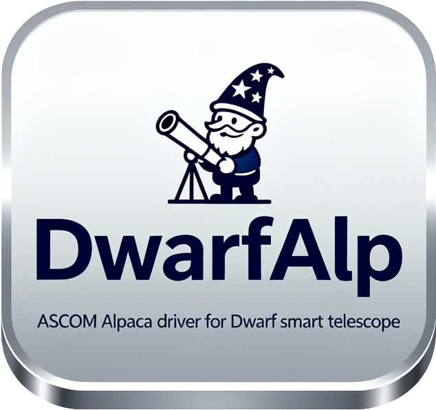

<p align="center">
  
</p>

# DWARF Alpaca Server

An ASCOM Alpaca device hub for DWARFLAB smart telescopes. The project speaks
WebSocket, HTTP/JSON, FTP, RTSP, and BLE protocols and exposes Telescope/0,
Camera/0, Focuser/0, and model-dependent FilterWheel/0 devices.

## Support status

| Model | Implemented profile | Automated | Physical verification in this audit |
| --- | --- | --- | --- |
| DWARF 2 | V3 1.20/device-4 path; no FilterWheel device | Yes | No |
| DWARF 3 | V3 1.20/device-4 path with model-specific filters | Yes | Yes; camera, focuser, filters, and 1 s NINA capture tested |
| DWARF mini | V3 1.20/device-4 path | Yes | Yes; camera and filter capture tested |

“Automated” means protocol mocks and simulation, not current-firmware hardware
certification. All models use the shared V3 command family while retaining their
own websocket client ID, sensor limits, and hardware capabilities. In particular,
DWARF 2 does not advertise an Alpaca FilterWheel device. See
[the engineering audit](docs/engineering-audit.md) for the exact
evidence and limitations.

## API documentation website

The publishable [API Observatory](docs/site/index.html) combines the generated
ASCOM Alpaca OpenAPI 3.1 specification with the reconstructed DWARFLAB local
HTTP API, all 356 APK WebSocket registrations, 123 response/error codes, and
the BLE provisioning registry. Regenerate its machine-readable data with:

```powershell
uv run python scripts/extract_apk_api_inventory.py build/apk-audit-3.4.1/decompiled/sources docs/apk-analysis/api-inventory.json --markdown-output docs/apk-analysis/websocket-code-registry.md
uv run python scripts/generate_api_site.py
```

To publish it, select **GitHub Actions** as the Pages source in the repository's
Settings > Pages screen. The `Publish API documentation` workflow deploys
`docs/site` after a push to `main`. For a local preview:

```powershell
uv run python -m http.server 8000 --directory docs/site
```

---

## Highlights

- **End-to-end DWARF bridge** – `DwarfSession` maintains websocket, HTTP, FTP, and BLE clients, negotiates the master lock, and caches notifications for low-latency Alpaca responses.
- **Full Alpaca surface area** – Telescope, camera, focuser, and filter wheel routers translate Alpaca verbs into real DWARF commands including go-to slews, joystick motion, exposure setup, filter selection, and temperature polling.
- **Capture pipeline** – Exposure requests map durations to DWARF parameter tables, monitor dark-library status, trigger astro captures, stop when `15209.current_count` reaches the requested raw-frame count, and harvest the matching FITS through FTP or the app-equivalent HTTP album/FITS-list workflow.
- **Filter handling** – Automatic discovery of filter definitions, IR-cut coordination, and persistence of the active slot for imaging tasks.
- **Provisioning workflow** – BLE onboarding stores STA credentials in `var/connectivity.json`, updates settings dynamically, and feeds the combined `dwarf-alpaca start` command.
- **Structured logging & tests** – `structlog` JSON output, rotating startup logs, and a pytest suite covering discovery, CLI flows, session orchestration, and device endpoints.

---

## Project Layout

```
├── docs/
│   ├── architecture.md       # Deep dive into services and data flow
│   ├── integration_plan.md   # Future integration checkpoints
│   └── DWARF API2.txt        # Vendor protocol notes
├── src/dwarf_alpaca/
│   ├── cli.py                # CLI entry point (serve/start/provision/guide)
│   ├── server.py             # FastAPI app, discovery service, filter preload
│   ├── config/               # Pydantic settings + YAML loader
│   ├── devices/              # Alpaca routers (telescope, camera, focuser, filter wheel)
│   ├── discovery.py          # UDP discovery responder
│   ├── dwarf/                # Session coordinator, ws/http/rtsp/ftp/BLE helpers
│   ├── management/           # Alpaca management endpoints
│   └── proto/                # Protobuf definitions generated from DWARF specs
├── tests/                    # pytest-based coverage of routers and helpers
├── var/                      # Runtime state (connectivity, logs, temp files)
├── scripts/                  # Maintenance helpers (config dumps, etc.)
├── pyproject.toml            # Packaging metadata and dependencies
└── README.md
```

---

## Quick Start

### 1. Prerequisites

- Python 3.10+
- Windows PowerShell (repo commands assume Windows; adjust paths for macOS/Linux)
- System packages required by `aiortc` / `av` (FFmpeg, libopus, etc.)
- Optional: Bluetooth adapter compatible with [Bleak](https://github.com/hbldh/bleak)

### 2. Create a virtual environment

```powershell
python -m venv .venv
.\.venv\Scripts\Activate.ps1
pip install -e .
```

For development extras (ruff, pytest, httpx CLI):

```powershell
pip install -e .[development]
```

For the reproducible locked environment:

```powershell
uv sync --extra development --locked
```

Generate or validate protobuf bindings:

```powershell
python scripts/generate_protos.py
python scripts/generate_protos.py --check
```

### Select a model

```powershell
$env:DWARF_ALPACA_DWARF_DEVICE_MODEL = "dwarfmini" # or dwarf3 / dwarf2
$env:DWARF_ALPACA_DWARF_AP_IP = "192.168.88.1"
dwarf-alpaca serve
```

The model selects a capability profile and default client ID. An explicit
`DWARF_ALPACA_DWARF_WS_CLIENT_ID` still overrides the client ID.

### Capture behavior

Alpaca capture uses the intended astronomy/raw-live-stacking workflow so exposure,
gain, filter, binning, frame count, dark status, and FITS output can be checked.
Direct mini `PHOTO_RAW`/`PHOTOGRAPH` capture is disabled by default because available
evidence does not prove long-exposure, gain, and raw-output guarantees.

Like the official app's **Continue** action, light exposures proceed by default when
a matching dark is missing or its temperature differs too much. The condition and any
automatic `force_start` retry are logged. Set `allow_continue_without_darks=false` to
make dark-library warnings fail the exposure; the driver never starts a long
dark-capture procedure itself.

`CanStopExposure` is false because distinct graceful-stop behavior is unproved.
`CanAbortExposure` is true for the selected astronomy workflow.

### Hardware tests

Hardware tests never run by default and contain no motor movement or GOTO:

```powershell
$env:DWARF_ALPACA_RUN_HARDWARE = "1"
$env:DWARF_ALPACA_DWARF_DEVICE_MODEL = "dwarfmini"
$env:DWARF_ALPACA_DWARF_AP_IP = "192.168.88.1"
pytest -m hardware tests/test_hardware_mini.py
```

Do not set the hardware flag unless the selected device is powered, attended, and
safe to connect.

### Minimal Alpaca client sequence

With the server at `http://127.0.0.1:11111`:

```powershell
$base = "http://127.0.0.1:11111/api/v1"
$tx = "ClientID=1&ClientTransactionID=1"

Invoke-RestMethod -Method Put -Uri "$base/camera/0/connected?$tx&Connected=true"
Invoke-RestMethod -Method Put -Uri "$base/filterwheel/0/connected?$tx&Connected=true"
Invoke-RestMethod -Method Put -Uri "$base/camera/0/gain?$tx&Gain=60"
Invoke-RestMethod -Method Put -Uri "$base/filterwheel/0/position?$tx&Position=0"
Invoke-RestMethod -Method Put -Uri "$base/camera/0/binx?$tx&BinX=1"
Invoke-RestMethod -Method Put -Uri "$base/camera/0/biny?$tx&BinY=1"
Invoke-RestMethod -Method Put -Uri "$base/camera/0/startexposure?$tx&Duration=15&Light=true&FrameCount=1"

Invoke-RestMethod -Uri "$base/camera/0/percentcompleted?$tx"
Invoke-RestMethod -Uri "$base/camera/0/imageready?$tx"
Invoke-RestMethod -Uri "$base/camera/0/imagebytes?$tx"
```

Query `/filterwheel/0/names` first and choose the corresponding zero-based position.
Do not poll `imagebytes` until `imageready` is true. By default the driver follows
the app's Continue path when no temperature-matched dark is available. Append
`&ContinueWithoutDark=false` to a `startexposure` request if that exposure must fail
instead of continuing without a matching dark.

### 3. Choose a connection mode

| Scenario | How to run |
| --- | --- |
| **Simulation** | `setx DWARF_ALPACA_FORCE_SIMULATION true` (or use PowerShell `$env:DWARF_ALPACA_FORCE_SIMULATION = "true"` in-session) then `dwarf-alpaca serve`. The routers respond with synthetic data, ideal for UI development and tests. |
| **Hardware (existing Wi-Fi)** | Ensure the DWARF is connected to your Wi-Fi and that its STA IP is recorded in `var/connectivity.json` (or supply `--ssid`/`--password`). Run `dwarf-alpaca start --skip-provision --wait-timeout 180`. |
| **Hardware (provisioning required)** | Use the BLE guide to onboard Wi-Fi credentials: `dwarf-alpaca guide --adapter <optional-device> --ble-password <password>`. Credentials and STA IP are saved for subsequent runs. |

### 4. All-in-one launch

```powershell
dwarf-alpaca start --ssid "MySSID" --password "MyPassword" 
# ssid and password are optional arguments
```

- Prompts for BLE password if not provided (defaults to `DWARF_12345678`).
- Provisions the telescope, waits for STA connectivity, acquires the master lock, and starts the HTTP + discovery services.
- STA IP detection automatically updates `Settings.dwarf_ap_ip` before the server boots.

> Looking for the packaged Windows GUI? Follow the step-by-step guide in [`setup.md`](setup.md) to launch the compiled Control Center and configure clients such as NINA.

---

## Building the GUI Executable

Package the PySide6 control center into a standalone Windows executable with [PyInstaller](https://pyinstaller.org):

1. Activate the virtual environment (if not already active):

  ```powershell
  .\venv\Scripts\Activate.ps1
  ```

2. Install PyInstaller (one time per environment):

  ```powershell
  pip install pyinstaller
  ```

3. Build the executable:

  ```powershell
  pyinstaller --noconfirm --onefile --windowed --name DwarfAlpacaGUI --icon images/dwarfalplogo.ico --add-data "images;images" --add-data "var;var" --paths src run_gui.py
  ```

  The packaged binary will be created at `dist\DwarfAlpacaGUI.exe`. Update the `--add-data` entries if you need more resources bundled.

4. Launch the app directly from the `dist` directory to verify everything runs as expected.

---

## CLI Reference

| Command | Description |
| --- | --- |
| `dwarf-alpaca serve [--config path] [--ws-client-id value]` | Start only the Alpaca/HTTP/UDP services using the current settings. |
| `dwarf-alpaca start [options]` | Provision (optional), wait for connectivity, warm up the DWARF session, and then serve Alpaca. Supports `--skip-provision`, `--wait-timeout`, `--wait-interval`, and websocket client overrides. |
| `dwarf-alpaca guide [--adapter name] [--ble-password value]` | Interactive Bluetooth guide that lists DWARF devices, nearby SSIDs, and saves credentials. |
| `dwarf-alpaca provision [options] <SSID> <password>` | Non-interactive provisioning suitable for automation once you know the BLE address and Wi-Fi credentials. |

Rotating startup logs live in `var/logs/dwarf-alpaca-start.log` for later diagnosis.

---

## Configuration Cheatsheet

Settings may be supplied via env vars (`DWARF_ALPACA_*`), `.env`, or a YAML profile loaded with `--config`. Key options from `config/settings.py`:

| Setting | Default | Notes |
| --- | --- | --- |
| `http_host` / `http_port` | `0.0.0.0` / `11111` | Bind address and port for Alpaca HTTP API. |
| `http_scheme` | `http` | Switch to `https` when TLS files are provided. |
| `http_advertise_host` | `None` | Override the host reported in discovery packets. Auto-detected when unset. |
| `discovery_enabled` | `True` | Disable if another service handles UDP discovery. |
| `dwarf_ap_ip` | `192.168.88.1` | Fallback AP address. Overridden with STA IP after provisioning. |
| `dwarf_http_port` / `dwarf_jpeg_port` | `8082` / `8092` | DWARF REST/album ports. |
| `dwarf_ws_port` / `dwarf_rtsp_port` / `dwarf_ftp_port` | `9900` / `554` / `21` | Control-plane websocket, RTSP streaming, and FTP album ports. |
| `dwarf_ws_client_id` | Profile-derived | DAF2, DAF3, or DAF4 client identifier selected by model; an explicit value overrides it. |
| `ws_ping_interval_seconds` | `5.0` | Heartbeat cadence for the websocket. |
| `go_live_before_exposure` | `True` | Enable/disable RTSP warm-up before astro captures. |
| `allow_continue_without_darks` | `True` | Continue light captures when a dark is missing/unknown or temperature-mismatched, matching the app's Continue action. |
| `temperature_refresh_interval_seconds` | `5.0` | How often to poll DWARF temperature notifications. |
| `ble_adapter` / `ble_password` | `None` | Defaults for provisioning workflows. |
| `force_simulation` | `False` | Bypass hardware access and return simulated data. |
| `auto_calibrate_on_slew` | `True` | Use the app-equivalent target-based one-click calibration + GoTo for the first uncalibrated slew on any V3 DWARF. May move the telescope. |
| `calibrate_after_server_start` | `False` | Opt in to autofocus after startup; calibration waits for the first NINA GoTo because the firmware workflow needs a target. |
| `calibration_autofocus_timeout_seconds` | `120` | Maximum time to wait for the mandatory astronomical autofocus before calibration. |
| `calibration_timeout_seconds` | `300` | Allows firmware calibration to make multiple plate-solving attempts in poor sky conditions. |
| `site_latitude` / `site_longitude` | `None` | Observer coordinates in decimal degrees. Required for V3 mount calibration. |
| `geolocation_lookup_url` | `https://ipwho.is/` | User-triggered public-IP location estimate used by the Control Center. |

The first uncalibrated DSO slew follows the official Atlas workflow with command
`11013`: RA (hours), declination, target name, observer longitude/latitude, Deep Sky
shooting mode `2`, and `goto_only=false`. This lets the firmware calibrate against the
selected target and then continue directly to it. Command `15233` reports the combined
workflow state. Once calibration has been confirmed, later slews use regular GoTo
command `11002` until the configured calibration validity period expires.
Before `11013`, the driver mirrors the captured app setup by entering V3 astronomy
mode with `16404` and opening both tele (`10050`) and wide (`12036`) cameras. The
final `11013` response is monitored asynchronously because firmware can spend several
minutes making plate-solving attempts; Alpaca `SlewToCoordinatesAsync` therefore does
not mistake that long-running response for a missing command acknowledgement.

The Control Center reports calibration progress received on notification `15210` and
only reports firmware-confirmed success after notification `15256` supplies the
solved azimuth and altitude. Missing completion evidence is displayed and logged as
`not confirmed`, while an explicit firmware error is displayed as `failed`.
While calibration is active, the driver also writes a chronological calibration
trace for every incoming notification. Trace entries include elapsed time, sequence,
module/command names and IDs, packet type, payload length, and bounded payload hex;
the final entry records total duration, notification count, status, and error.
Every calibration first runs astronomical autofocus (`15004`) and waits for the shared
V3 autofocus-complete notification (`15278` or `15280`, state `3`). The GUI displays
the autofocus phase and the firmware's current plate-solving attempt count.
The standalone command `11000` accepts observer longitude and latitude, but hardware
testing showed that it can keep searching until firmware code `-11504` when no target
is supplied. Automatic operation therefore uses target-based command `11013`.
Enter exact decimal coordinates in Settings or use **Fetch current position** before
starting the server. The web lookup is deliberately user-triggered, sends the public IP
to the configured provider, and is only an estimate; verify it before calibration.
Coordinates supplied later through Alpaca `SiteLatitude` and `SiteLongitude` are used
for subsequent automatic calibration and saved by the Control Center.

See `config/profiles.yaml` for sample overlays.

---

## Runtime Architecture (Summary)

- **DiscoveryService** – Async UDP responder advertising device metadata and the HTTP URL.
- **FastAPI app** – Mounts Alpaca management, telescope, camera, focuser, and filter wheel routers. Middleware emits structured access logs.
- **DwarfSession** – Central orchestrator that:
  - Manages the websocket client (`DwarfWsClient`) for commands/notifications and master lock stewardship.
  - Wraps `DwarfHttpClient`, `DwarfFtpClient`, and `DwarfRtspClient` for REST, album, and live view access.
  - Handles exposure scheduling, filter presets, gain/exposure lookup tables, dark-library enforcement, and temperature monitoring.
  - Tracks device reference counts so connections tear down only when all Alpaca devices disconnect.
- **Provisioning workflow** – Uses `DwarfBleProvisioner` to push Wi-Fi credentials and persists STA state via `StateStore`.
- **Tests** – Cover CLI plumbing, UDP discovery packets, session behaviour, and endpoint compliance.

For a deeper exploration see [`docs/architecture.md`](docs/architecture.md).

---

## Observing Workflow

1. **Provision / connect** – Use `dwarf-alpaca start` to provision (if necessary) and acquire the DWARF master lock. When startup calibration preparation is enabled, it autofocuses but waits for a target before calibrating or slewing.
2. **Discover** – Clients broadcast Alpaca discovery; this server replies with Telescope/0, Camera/0, and Focuser/0 entries, plus FilterWheel/0 only on models that contain filters.
3. **Slew & track** – The first uncalibrated slew uses the V3 one-click calibration + GoTo workflow; subsequent slews use the regular DWARF astro GoTo command.
   Because Alpaca's coordinate-slew method has no target-name field, the driver resolves
   coordinates against NINA's local `NINA.sqlite` sky-atlas catalogue when it is available.
   This sends names such as `M11` to the DWARF instead of the generic `Custom` label.
4. **Focus** – Manual and continuous focus moves map to DWARF focus commands with live position updates from notifications.
5. **Filter selection** – On DWARF 3 and DWARF mini, Alpaca positions map to model-specific V3 `ir_index` values that are applied by the next astronomy-start command. DWARF 2 does not expose a filter wheel.
6. **Capture** – Exposure requests ensure gain/exposure indices, start astro capture, watch dark-library and raw-frame progress, and poll FTP concurrently. When `15209.current_count` reaches the requested frame count, or a new FITS appears first, the driver sends `11006`; it does not wait for the later `stacked_count`. FTP is preferred and scans only the newest timestamped astronomy folders first; the fallback mirrors the DWARFLAB app by reading `astroImageDetails.srcDir`, calling `/album/astro/fitsList`, and downloading the returned FITS rather than `stacked.jpg`. The selected path is logged as `dwarf.camera.ftp_capture_selected` or `dwarf.camera.astro_fits_selected`.
7. **Telemetry** – Temperature and camera metadata stream back into Alpaca GET endpoints for real-time monitoring.

---

## Testing

```powershell
pytest
```

The suite includes UDP discovery tests, CLI smoke coverage, session logic (mocked hardware), and device API verification. Add `-k` or `-m` filters when iterating on specific components.

---

## Troubleshooting

| Symptom | Suggestion |
| --- | --- |
| Discovery packets missing | Ensure UDP broadcasts reach the client network; set `http_advertise_host` to a routable IP. |
| Master lock denied | Confirm the websocket client ID matches your hardware family (DWARF3 vs DWARF2/Mini). |
| Exposures timeout | Check FTP connectivity to the STA IP; increase `ftp_timeout_seconds` / `ftp_poll_interval_seconds`. |
| BLE provisioning stalls | Supply `--ble-password` explicitly and verify the adapter name via `Get-PnpDevice -Class Bluetooth`. |
| RTSP preview unavailable | Install FFmpeg/AV dependencies and verify `dwarf_rtsp_port` (default 554) is reachable. |

---

## Roadmap

- Populate telescope site coordinates from settings and persist between sessions.
- Surface live pointing data (RA/Dec/Alt/Az) from websocket notifications rather than simulated motion when telemetry is available.
- Integrate RTSP preview frames into Alpaca `ImageArray` for faster plate solving.
- Expand automated tests with hardware-in-the-loop fixtures when a DWARF lab unit is available.
- Optional authentication / TLS profile for remote observatories.

---

## References

- DWARF API documentation and community research threads
- ASCOM Alpaca API specification
- NINA Alpaca integration guide
- [Bleak](https://github.com/hbldh/bleak) for BLE control
- [aiortc](https://github.com/aiortc/aiortc) and [PyAV](https://github.com/PyAV-Org/PyAV) for RTSP decoding
