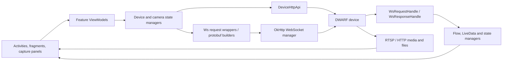

# Android application architecture

Applicable artifact: DWARFLAB 3.4.1 (677), base APK SHA-256
`1E4F676A35EBE6F9D8CB7B3FB4720346C45C41FC41B7E7807151B0080C5DE294`.

The application is a Kotlin/Java Android application using activities,
fragments, ViewModels, coroutines/Flow, LiveData, RxJava and generated
protobuf-Java classes. R8 obfuscates infrastructure classes into `defpackage`,
but feature and data-layer class names largely survive. Dependency and UI
libraries include AndroidX, Compose components, Retrofit/OkHttp, protobuf,
MMKV, Media3/IJKPlayer and vendor analytics/push/support SDKs.

## Component map

| Layer | Representative components | Responsibility |
|---|---|---|
| Application | `base.App` | dependency roots and global connection state |
| Entry/UI | `SplashActivity`, `MainActivity`, `CaptureActivity`, `AlbumActivity`, `CaliFrameActivity`, `AtlasActivity` | startup, capture, media, calibration frames and GOTO |
| Presentation | `DeviceConnectViewModel`, `CaptureViewModel`, `AtlasViewModel`, schedule and stack ViewModels | user action orchestration |
| State | `CameraStateManager`, `data.websocket.*` handlers | response/notification decoding and observable state |
| Request model | `data.bean.ws.request.Ws*Req` | command selection and protobuf construction |
| Envelope | `BaseProto.WsPacket` | binary WebSocket framing |
| WebSocket | `IWsManager`, obfuscated implementation `m3a` | OkHttp connection, binary send, reconnect and callbacks |
| Discovery | `DiscoveryEngine`, `net.connection.manualip.*` | LAN discovery and explicit-IP connection |
| Local HTTP | `DeviceHttpApi` | device information, media/log operations on port 8082 |
| BLE | `BluetoothPacketSender`, `data.bean.ble.*`, `DeviceConnectViewModel` | discovery and Wi-Fi provisioning |
| Foreground service | `HeartbeatService` | connection-loss notification and delayed shutdown; not the wire heartbeat itself |
| Media/native | Media3, IJKPlayer and arm64 media libraries | preview/playback/processing |
| Firmware/cloud | `NetHttpApi`, OTA ViewModels | account, update, sharing and support; separate from local control |

The manifest permits cleartext traffic and points at a network-security
configuration. This is consistent with local `ws://` and `http://` transports.
Cloud/account APIs are not required by dwarfAlp and are intentionally excluded
from production device control.

## Firmware, native code and data

The base APK has no native libraries. The arm64 split supplies 15 libraries,
including astronomy and all-sky renderers, IJK/FFmpeg media libraries, speech
support, MMKV and binary-diff update support. Assets include
`astronomy_data.db` and astronomy imagery. No evidence found so far places
WebSocket protobuf framing behind JNI; generated Java descriptors and request
wrappers form the active control path.

## State and error flow

`WsRequestHandle` parses each binary frame as `BaseProto.WsPacket`, indexes
pending requests using the response command, decodes `data` into the expected
protobuf class, evaluates a response matcher, removes the pending request and
resumes its coroutine. Separate response handlers process unsolicited device,
camera, focus, progress, dark-frame and error notifications into state
managers. Failed sends trigger WebSocket reconnection in `m3a`.
