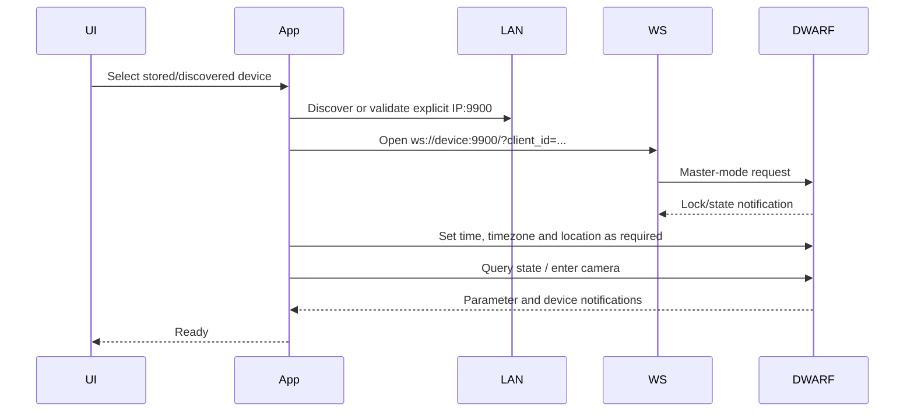

# Reconstructed workflows

## Connection and camera initialization



## Mini Deep Sky light frame

```mermaid
sequenceDiagram
    participant N as NINA
    participant A as dwarfAlp
    participant D as DWARF Mini
    N->>A: Select Astro or Duo-Band
    Note over A: Cache selection only; no wheel-move command
    N->>A: StartExposure(duration, Light=true)
    A->>D: 11041 exact exposure/gain/frame tuple
    D-->>A: Echo tuple / status
    A->>D: 11005 ReqCaptureRawLiveStacking(ir_index=1 or 2)
    D-->>A: Capture state/progress notifications
    A->>D: Retrieve newly created capture
    A-->>N: ImageReady + image array
```

The 11040 presets observed on Mini firmware 1.1.3 build 2 include normal modes
such as 15/30/60/90/180 seconds and a short tuple. Hardware probing confirmed
that 11041 accepts and echoes an exact `0|0|1|60|1|null` tuple. This explains
why rejecting 1 second solely because it is absent from the initially returned
firmware list disagreed with the official app.

## Mini dark/calibration frame

Dark is not a selectable normal-app filter. It is calibration-frame type 0 with
filter type 3, sent through command 11045:

```text
ReqCaptureCaliFrame
  1 exp_index
  2 gain
  3 resolution
  4 cap_size
  5 camera_type
  6 cali_frame_type
  7 filter_type (optional)
  8 scene_type
```

The APK maps normal filter values NONE=-1, VIS=0, ASTRO=1, DUO_BAND=2 and
DARK=3. For Mini dark capture the evidenced values are dark filter 3,
calibration type 0, tele camera 0, and scene 0 (settings) or 1 (shooting).
Resolution is 4K=0, 1080=1, 720=2. Stop is 11046; state/progress are
15290/15291.

dwarfAlp intentionally does not expose Light=false as working yet. Although the
start schema is confirmed, final file type, completion state and delivery to
NINA have not been hardware-verified. Enabling it would risk returning a stale
or non-image result.

## Abort and recovery

The device rejected Alpaca `AbortExposure` for `photo_workflow`. The driver must
advertise support according to the active workflow and must never claim an
abort completed when only a task was cancelled locally. Astronomy stop 11006
is distinct from the 11046 calibration stop. Recovery must cancel pending
waits, clear the capture baseline, observe device-ready state, and reject files
created before the new request.
