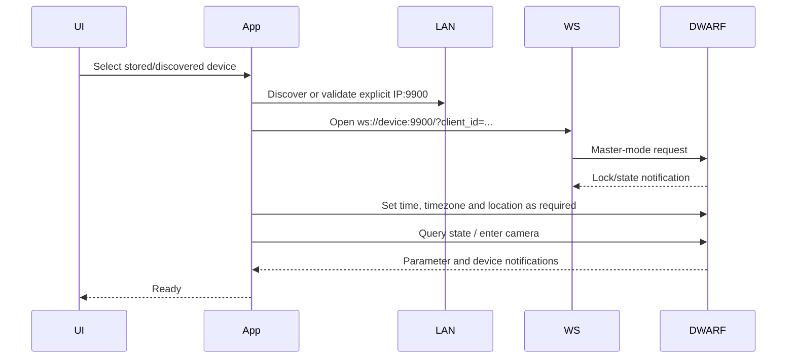

# Reconstructed workflows

## Connection and camera initialization



## V3 Deep Sky light frame (DWARF 2, DWARF 3, Mini)

```mermaid
sequenceDiagram
    participant N as NINA
    participant A as dwarfAlp
    participant D as DWARF
    N->>A: Select Astro or Duo-Band
    Note over A: Cache selection only; no wheel-move command
    N->>A: StartExposure(duration, Light=true)
    A->>D: POST shootingMode/getParamAndSetting {modeId:2}
    D-->>A: Live exposure names/indices, gain values, parameter IDs
    A->>D: 16700 exposure param (manual, exact firmware index)
    A->>D: 16701 gain param (manual, requested gain)
    A->>D: 11041 prime persisted quick-set tuple
    A->>D: 16703 absolute frame count
    A->>D: 11005 ReqCaptureRawLiveStacking(ir_index=1 or 2)
    D-->>A: 15264 active capture-parameter namespace (module 15)
    A->>D: 16700/16701/16703 reapply in active namespace
    D-->>A: Capture state/progress notifications
    Note over A,D: Delayed -11514 is nonfatal if shooting continues
    A->>D: 11006 when 15209.current_count reaches requested frames
    D-->>A: 15208 stopping (2), then stopped (3)
    Note over A: Do not start the next exposure before idle/stopped
    A->>D: FTP FITS, or album mediaType=4
    D-->>A: astroImageDetails.srcDir
    A->>D: POST /album/astro/fitsList {srcDir}
    D-->>A: fitsInfo[{filePath,isFailed,url}]
    A->>D: GET filePath on static port 80
    A-->>N: ImageReady + image array
```

APK 3.4.1 obtains the authoritative parameter catalogue from
`POST /shootingMode/getParamAndSetting` with `modeId=2`. On Mini firmware 1.1.3
build 2 it reported exposure parameter `144396663052566529`, gain parameter
`144396663052566530`, 1 second as index `120`, and 5 seconds as index `141`.
Command 11041 is a quick-set selector (`ReqSetQuickSet.info_id`), not an
arbitrary parameter setter. The failed driver run sent a 5-second-looking
quick-set string but progress later reported index `156`, which is 15 seconds.
A Mini live test found that issuing 11041 before 16700 makes current firmware
reject 16700 with code -1. The interoperable order is 16700/16701, 11041, then
16703. Firmware without the live parameter commands can fall back to the full
11041 tuple. This order also primes DWARF 3 before 11005. Notification 15288 reports the
firmware-selected duration. The driver records that value and still returns the
matching fresh FITS; discarding an exposure after StartExposure has returned
would leave Alpaca clients polling ImageReady until their timeout.

Current DWARF 3 firmware can reload a saved 15-second preset while `11005` is
preparing the capture. Its `15264` parameter-state packets are emitted from
module 15 (camera parameters), not module 9, and reveal the active internal
namespace (mode 11 or 13 was observed). The driver detects that namespace and
reapplies exposure, gain, and frame count there. Also, the fifth component of
the `11041` tuple is resolution, not frame count; frame count belongs solely to
`16703`. A live 0.001-second/gain-0 test then returned a non-uniform FITS with
pixel range 200..1649. Uniform 4095..4095 daylight samples were genuine 12-bit
saturation and may appear black in a viewer with no display range.

### Driver versus APK 3.4.1

| Stage | Old driver | Current APK workflow / corrected driver |
|---|---|---|
| Discover values | 11040 quick-set list only | HTTP mode-2 parameter catalogue |
| Exposure | rewrite a 11041 string | try 16700 with catalogue index, prime 11041, then reapply in the runtime namespace reported by module-15 notification 15264; use 15288 as applied duration |
| Gain | rewrite a 11041 string | 16701 with catalogue gain value |
| Frame count | 16703 | 16703 |
| Start | 11005 | 11005 |
| Completion | stop when FTP polling times out | stop when `15209.current_count` reaches the requested raw-frame count or a new FITS appears; do not wait for later `stacked_count` |
| Start warning | delayed nonzero response failed the local capture task | keep retrieval alive for `-11514` when firmware progress/file creation shows shooting continues |
| Repeat capture | start again as soon as NINA consumed the FITS | track `15208` (`0/1/2/3` = idle/running/stopping/stopped), query `16405` if needed, and wait for idle/stopped before the next `11005` |
| Retrieval | generic album item could return `stacked.jpg` | prefer FITS; resolve `astroImageDetails.srcDir` through `/album/astro/fitsList` and download `filePath` from port 80 |
| Retrieval safety | changed album path could be accepted | baseline astronomy media type 4, require capture-time evidence, and reject stale album media |
| FTP scan | recursively inspect every astronomy folder | parse folder timestamps and inspect only the newest folders; 94-folder Mini storage improved from about 26 seconds to 1.1 seconds in the connected-device test |
| NINA array | JPEG could remain RGB/3-D | JPEG fallback is converted to a 2-D array; FITS remains preferred |

## Alpaca coordinate slew target names

ASCOM Alpaca `SlewToCoordinatesAsync` defines right ascension and declination but
does not transmit the selected atlas object's display name. Sending the DWARF
request unchanged therefore labels the target `Custom`. DwarfAlp now checks NINA's
local `NINA.sqlite` sky-atlas catalogue, comparing the supplied coordinates with
both J2000 and current-epoch positions. The hardware-test coordinates for M11 resolve
to `M11`, which is then placed in the V3 GoTo request. If no close catalogue match is
available, the driver retains `Custom` rather than guessing.

## Mini dark/calibration frame

Dark is not a selectable normal-app filter. It is calibration-frame type 0 with
filter type 3, sent through command 11045:

```text
ReqCaptureCaliFrame
  1 exp_index
  2 gain
  3 resolution
  4 cap_size
  5 camera_type
  6 cali_frame_type
  7 filter_type (optional)
  8 scene_type
```

The APK maps normal filter values NONE=-1, VIS=0, ASTRO=1, DUO_BAND=2 and
DARK=3. For Mini dark capture the evidenced values are dark filter 3,
calibration type 0, tele camera 0, and scene 0 (settings) or 1 (shooting).
Resolution is 4K=0, 1080=1, 720=2. Stop is 11046; state/progress are
15290/15291.

dwarfAlp intentionally does not expose Light=false as working yet. Although the
start schema is confirmed, final file type, completion state and delivery to
NINA have not been hardware-verified. Enabling it would risk returning a stale
or non-image result.

## Abort and recovery

The device rejected Alpaca `AbortExposure` for `photo_workflow`. The driver must
advertise support according to the active workflow and must never claim an
abort completed when only a task was cancelled locally. Astronomy stop 11006
is distinct from the 11046 calibration stop. Recovery must cancel pending
waits, clear the capture baseline, observe device-ready state, and reject files
created before the new request.
