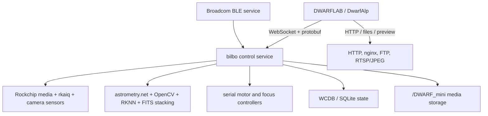

# Platform architecture

| Property | Finding | Evidence | Confidence |
|---|---|---|---|
| CPU | ARMv7-A / ARM32, little-endian | ELF headers and ARM attributes | VERIFIED |
| ABI | EABI5, VFP register arguments, hard float | `readelf -h/-A` | VERIFIED |
| ISA features | VFPv4 and NEON | ELF ARM attributes | VERIFIED |
| libc/loader | uClibc, `/lib/ld-uClibc.so.0` | ELF interpreters | VERIFIED |
| SoC family | Rockchip RV1106 | build paths plus RKNN/RGA/MPP/Rockit/rkaiq dependencies | HIGH |
| Kernel ABI | Linux 5.10.160, ARMv7 Thumb-2 | sensor-module `vermagic` | VERIFIED |
| Compiler | crosstool-NG 1.24.0, GCC 8.3.0 | ELF comment data | VERIFIED |
| Distribution | BusyBox-style embedded Linux | startup scripts and utility conventions | HIGH |
| Bootloader | Not supplied | no bootloader artifact | UNKNOWN |

Important linked components include libhv, zlog, OpenCV 4.09, OpenSSL 1.1,
CFITSIO, WCDB, protobuf 3.19.6, FFmpeg (libavcodec 58/libavformat 58), x264.164,
Exiv2 0.28, Rockchip MPP/RGA/RKNN/rkaiq/rockit, WCS, and librtprocess.
Versions are taken from filenames or binary metadata where present. **VERIFIED**
