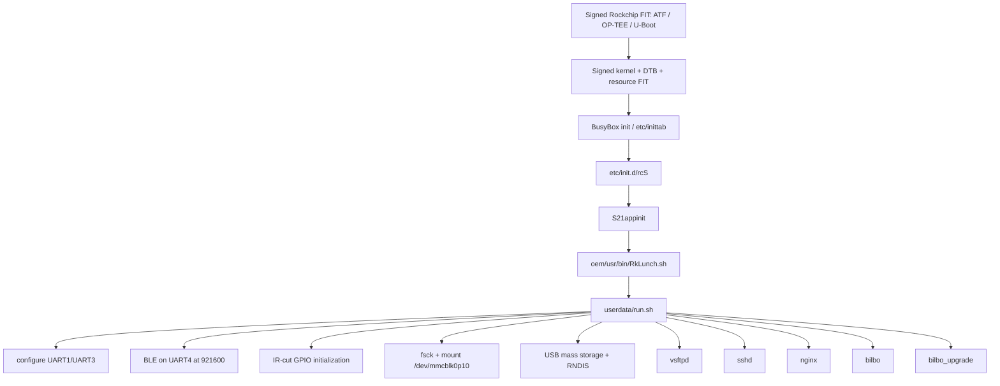

# Boot and service startup

The update manifest installs `S50usbdevice` under `/etc/init.d`. The live rootfs
now resolves the parent chain: BusyBox init reads `/etc/inittab`, invokes
`/etc/init.d/rcS`, runs `S21appinit`, and enters OEM startup through
`/oem/usr/bin/RkLunch.sh`. OEM startup loads modules and executes
`/userdata/run.sh`. **VERIFIED from the live image**

`run.sh` mounts the exFAT media partition at `/DWARF_mini`, configures a USB
gadget, and starts the visible services. It initializes IR-cut GPIOs 70, 71, 2,
and 3. BLE uses UART4 and a Broadcom BSA server with GPIO 48 as reset. UART1 and
UART3 are configured; their exact motor assignments are not proven. **VERIFIED**

`bilbo` output is redirected to `/dev/null`; its internal zlog and downloadable
log facilities are therefore more useful than stdout. **VERIFIED**
