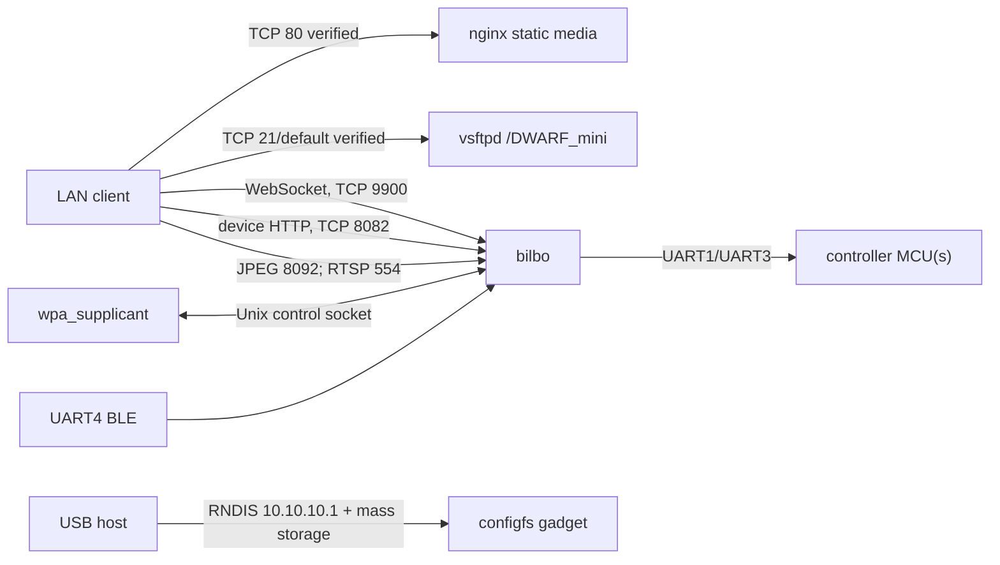

# Network services and IPC

| Port/interface | Protocol/process | Reachability | Purpose | Confidence |
|---|---|---|---|---|
| TCP 80 | nginx HTTP | LAN/USB network | `/DWARF_mini` static files, permissive CORS | VERIFIED |
| TCP 21 default | vsftpd | LAN/USB network | media storage access | VERIFIED |
| TCP 22 default | sshd | likely LAN | shell/maintenance | MEDIUM; port config absent |
| TCP 9900 | `bilbo` WebSocket | LAN/AP | protobuf device commands | VERIFIED; `bilbo` server constant `0x26ac` |
| TCP 8082 | `bilbo` HTTP API | LAN/AP | album/config/update API | VERIFIED; `bilbo` server constant `0x1f92` |
| TCP 8092 | JPEG service | LAN/AP | live/stacked images | VERIFIED; `bilbo` TCP-server constant `0x1f9c` |
| TCP 554 | `bilbo` RTSP service | LAN/AP | preview/video stream | VERIFIED; startup passes `0x22a` to the RTSP bind routine |
| USB 10.10.10.1 | RNDIS | attached host only | direct network link | VERIFIED |

The USB script also contains dormant declarations for ADB, MTP, UVC, NTB, ACM,
UAC, and HID. The current startup enables mass storage and RNDIS; presence of
the dormant functions does not prove those interfaces are exposed. **VERIFIED**

No MQTT, D-Bus, ZeroMQ, or explicit application Unix socket was found.
Absence cannot be proven because the full rootfs is unavailable. **UNKNOWN**
