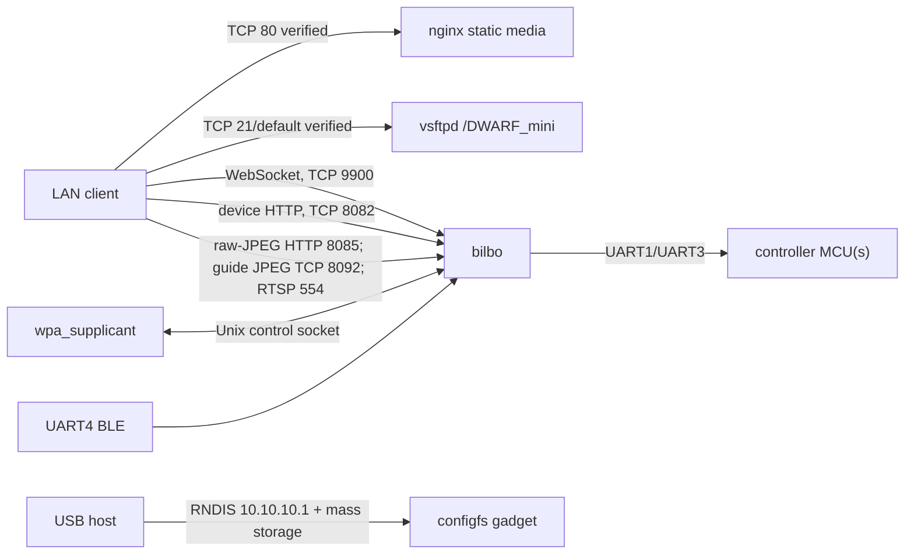

# Network services and IPC

| Port/interface | Protocol/process | Reachability | Purpose | Confidence |
|---|---|---|---|---|
| TCP 80 | nginx HTTP | LAN/USB network | `/DWARF_mini` static files, permissive CORS | VERIFIED |
| TCP 21 default | vsftpd | LAN/USB network | media storage access | VERIFIED |
| TCP 54227 | sshd | LAN/AP | shell/maintenance | VERIFIED live; authentication policy still unknown |
| TCP/UDP 9900 | `bilbo` | LAN/AP | WebSocket protobuf commands plus UDP discovery/service traffic | VERIFIED live and static (`0x26ac`) |
| TCP 8082 | `bilbo` HTTP API | LAN/AP | album/config/update API | VERIFIED; `bilbo` server constant `0x1f92` |
| TCP 8085 | `bilbo` libhv HTTP | LAN/AP | `/raw_jpg?stack=...&bits=...` endpoint | VERIFIED live and static (`0x1f95`) |
| TCP 8092 | `bilbo` `JpgServer` | LAN/AP | lower-level JPEG/guide stream (`sendCamGuideStream`) | VERIFIED live and static (`0x1f9c`) |
| TCP 554 | `bilbo` RTSP service | LAN/AP | preview/video stream | VERIFIED; startup passes `0x22a` to the RTSP bind routine |
| TCP 3893 | `bilbo`, loopback only | device-local | internal service; exact consumer unresolved | VERIFIED listener; purpose UNKNOWN |
| USB 10.10.10.1 | RNDIS | attached host only | direct network link | VERIFIED |

The USB script also contains dormant declarations for ADB, MTP, UVC, NTB, ACM,
UAC, and HID. The current startup enables mass storage and RNDIS; presence of
the dormant functions does not prove those interfaces are exposed. **VERIFIED**

Port 8092 is not the HTTP `/raw_jpg` endpoint. A plain HTTP request to 8092
waits for the stream protocol, while 8085 returns libhv HTTP responses and owns
the recovered raw-JPEG route. Completed astronomy FITS files remain album/media
objects served through the port-8082 metadata and port-80 file workflow.

No MQTT, D-Bus, or ZeroMQ service was observed. **VERIFIED for this live Mini**
