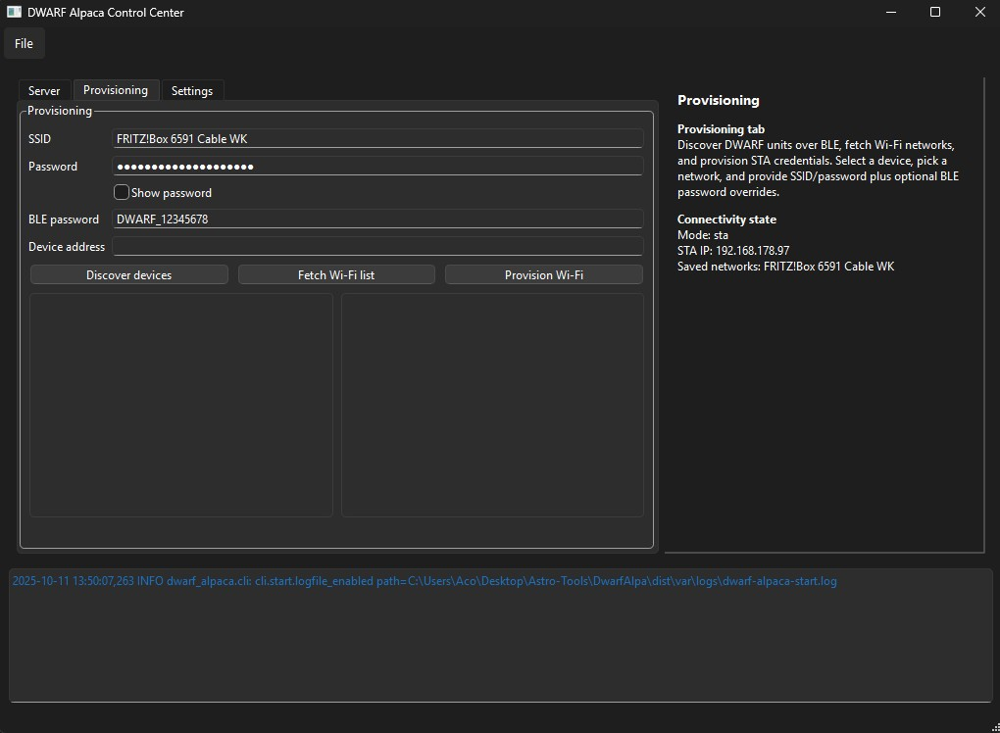
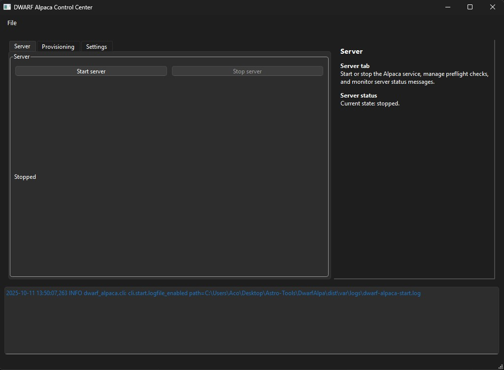
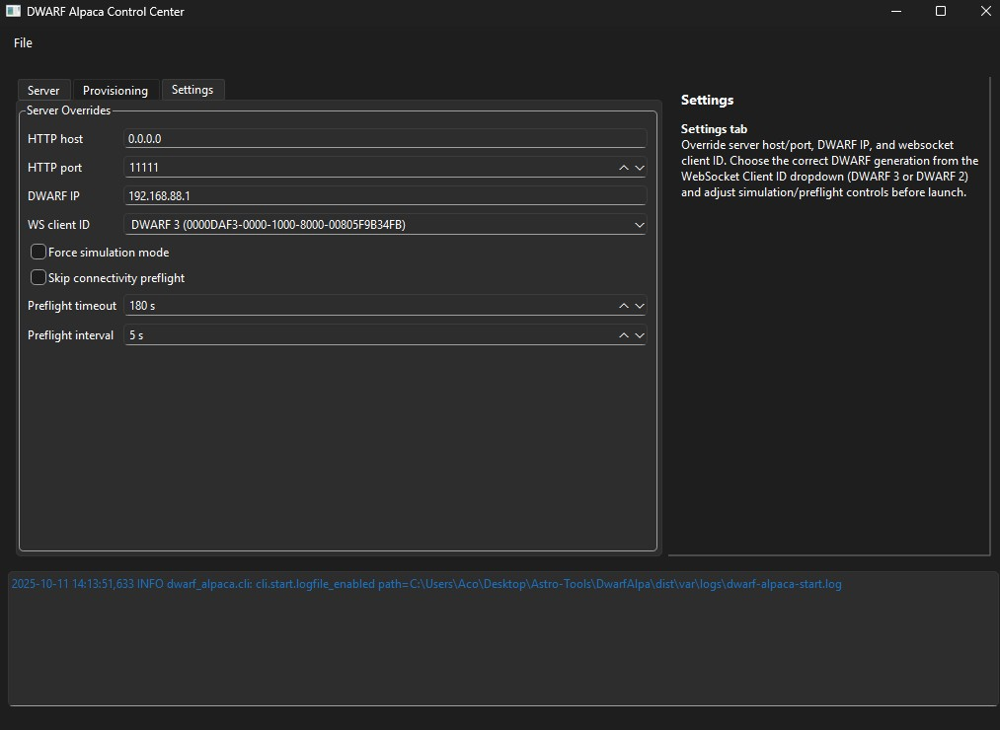
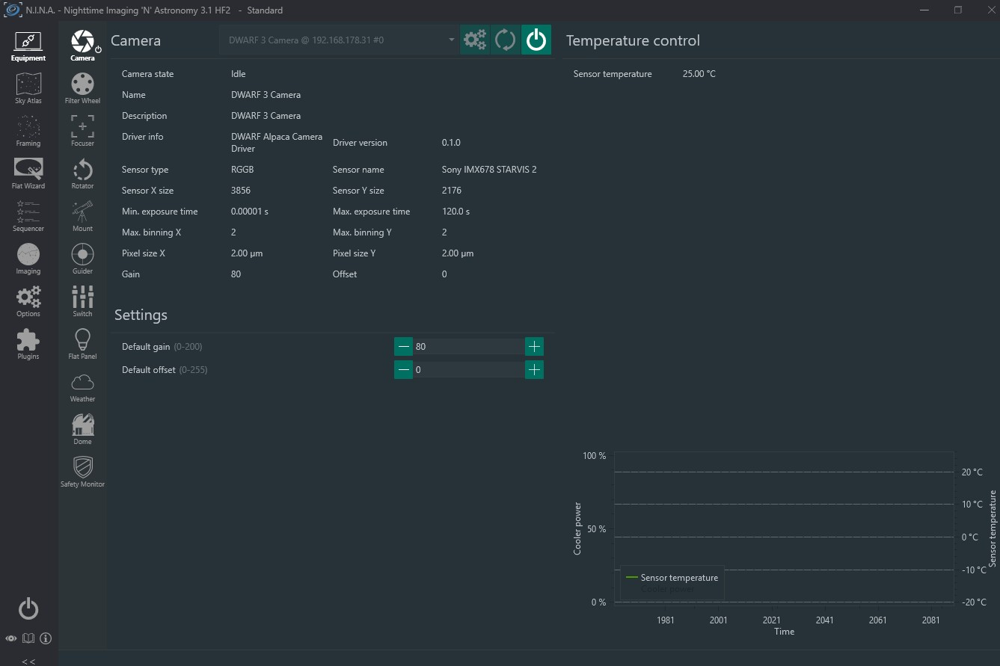
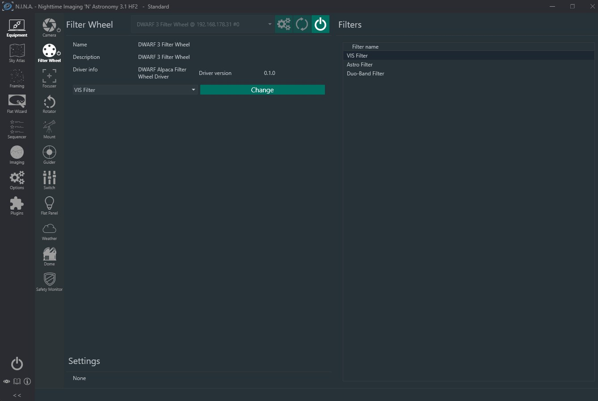
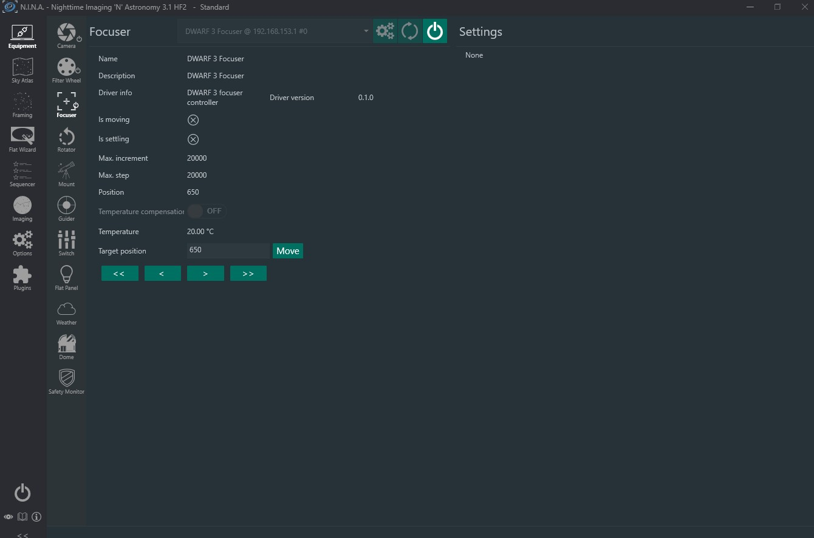
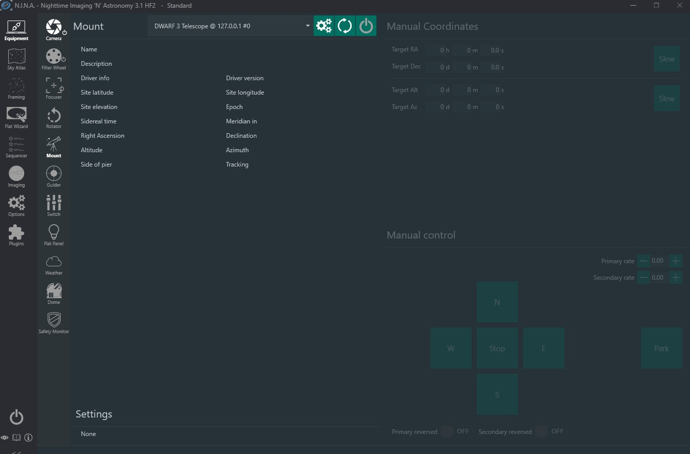
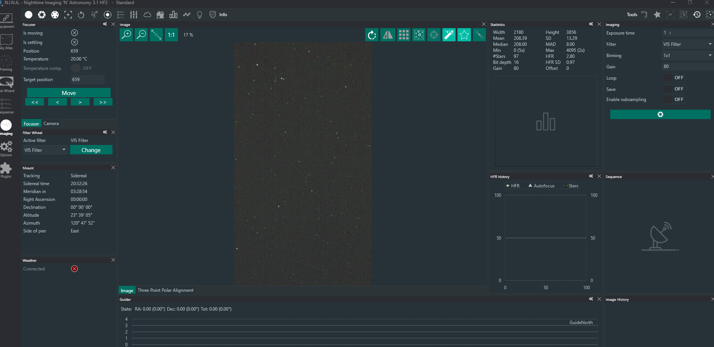

# Setup and validation

## Reproducible development environment

Python 3.10 or newer is supported. On PowerShell:

```powershell
python -m venv .venv
.\.venv\Scripts\Activate.ps1
python -m pip install uv
uv sync --extra development --locked
python scripts/generate_protos.py --check
python -m pytest -q
```

Regenerate bindings after editing a `.proto` file:

```powershell
python scripts/generate_protos.py
python scripts/generate_protos.py --check
```

The generator is pinned through the development dependencies, rewrites generated
imports for package use, and works with Windows or Linux path conventions.

## Simulation

```powershell
$env:DWARF_ALPACA_FORCE_SIMULATION = "true"
$env:DWARF_ALPACA_DISCOVERY_ENABLED = "false"
dwarf-alpaca serve
```

Open `http://127.0.0.1:11111/management/apiversions` to confirm startup.

## Select physical hardware

For a mini:

```powershell
$env:DWARF_ALPACA_DWARF_DEVICE_MODEL = "dwarfmini"
$env:DWARF_ALPACA_DWARF_AP_IP = "192.168.88.1"
dwarf-alpaca serve
```

For a DWARF 3:

```powershell
$env:DWARF_ALPACA_DWARF_DEVICE_MODEL = "dwarf3"
$env:DWARF_ALPACA_DWARF_AP_IP = "192.168.88.1"
dwarf-alpaca serve
```

The selected profile controls the protocol envelope, device ID, client ID, commands,
filters, image metadata, and honest stop/abort flags. A configured
`DWARF_ALPACA_DWARF_WS_CLIENT_ID` overrides the profile client ID.

## Alpaca capture

Connect the camera and filter wheel, query filter names, then set gain, filter position,
binning, and start an exposure. The complete PowerShell sequence is in the README.
Exposure, gain, filter, binning, and frame-count application failures stop the request;
the driver does not silently reuse prior values. A missing or unknown dark also fails
unless that request explicitly includes `ContinueWithoutDark=true`.

The production capture route is the astronomy/raw-live-stacking workflow. Direct photo
capture remains disabled by default because it is not proven to honor every Alpaca
parameter or return the expected astronomical raw product.

## Safe hardware validation

The mini test acquires the master lock and opens the camera only. It performs no focus
movement, GOTO, or capture:

```powershell
$env:DWARF_ALPACA_RUN_HARDWARE = "1"
$env:DWARF_ALPACA_DWARF_DEVICE_MODEL = "dwarfmini"
$env:DWARF_ALPACA_DWARF_AP_IP = "192.168.88.1"
python -m pytest -q -m hardware tests/test_hardware_mini.py
```

Only set the opt-in flag while the correct telescope is powered, attended, and safely
reachable. Record firmware/app versions separately before broader manual capture tests.

## DWARF 3 hardware checklist

No DWARF 3 was physically certified in this audit. When a unit is available, validate
in this order and stop on the first protocol mismatch:

1. Record model and firmware; connect, acquire master lock, query configuration.
2. Open/close camera; query temperature; initialize focus without moving it.
3. Discover exposure, gain, filter, binning, and frame-count parameters.
4. Apply one safe value of each and confirm the device response/notification.
5. With an existing matching dark, perform one short attended astronomy capture.
6. Confirm progress/state sequence, new-file identity, FITS metadata, abort, reconnect.

Sanitize network addresses, device identifiers, credentials, and image metadata in
shared logs.

## Windows GUI executable

```powershell
pyinstaller --noconfirm --clean --onefile --windowed `
  --name DwarfAlpacaGUI `
  --icon images/dwarfalplogo.ico `
  --add-data "images;images" `
  --add-data "var;var" `
  --paths src run_gui.py
```

The result is `dist\DwarfAlpacaGUI.exe`.

## Use the compiled Control Center

1. Keep `DwarfAlpacaGUI.exe`, `images\`, and `var\` together in a writable directory.
2. Launch the executable and allow its HTTP and UDP discovery ports through Windows
   Defender Firewall when prompted.
3. On the Settings tab, select the correct DWARF model and reachable AP/STA address.
   Enable simulation when validating a client without hardware.
4. Start the server and watch the status/log pane for connectivity, master-lock, and
   startup errors. Stop it from the same window for graceful session cleanup.

The Provisioning tab can discover a telescope over BLE, list Wi-Fi networks, and send
STA credentials. Provisioning state is saved in `var\connectivity.json`. This file may
contain a plaintext Wi-Fi password; protect it as a credential and do not attach it to
bug reports.







## Configure NINA

NINA normally discovers Alpaca devices automatically. If it does not, use **Scan for
devices** and make sure the Windows host and HTTP port match the Control Center.

1. Under **Options → Equipment → Camera**, add an ASCOM Alpaca camera and select the
   advertised DWARF camera device.
2. Add the advertised filter wheel, focuser, and telescope under their corresponding
   Equipment pages, reusing the same host and port.
3. Save the NINA equipment profile.
4. Query the filter names and supported camera gain/exposure properties before building
   a sequence. Begin with an attended short astronomy exposure for which a matching
   dark exists.











## Troubleshooting

| Symptom | Check |
| --- | --- |
| Hardware endpoint unreachable | Join the telescope AP or confirm its saved STA address; test ports 9900, 8082, and 21. |
| Master lock rejected | Confirm the selected model/profile and close another app that owns the device. |
| Capture configuration fails | Query supported gains/exposures/filters and inspect the exact failed parameter; no fallback is intentional. |
| Dark status missing | Supply a matching dark, or explicitly accept the limitation for that single request. |
| Capture start becomes unknown | Look for progress/observation/device-state evidence; a timeout alone is never success. |
| Image retrieval times out | Check FTP/album reachability and ensure a new file was written after the capture start time. |
| Generated module missing/stale | Run the generator and its `--check` command in the locked development environment. |
| GUI executable fails | Inspect `build\DwarfAlpacaGUI\warn-DwarfAlpacaGUI.txt` and rebuild with `--clean`. |
