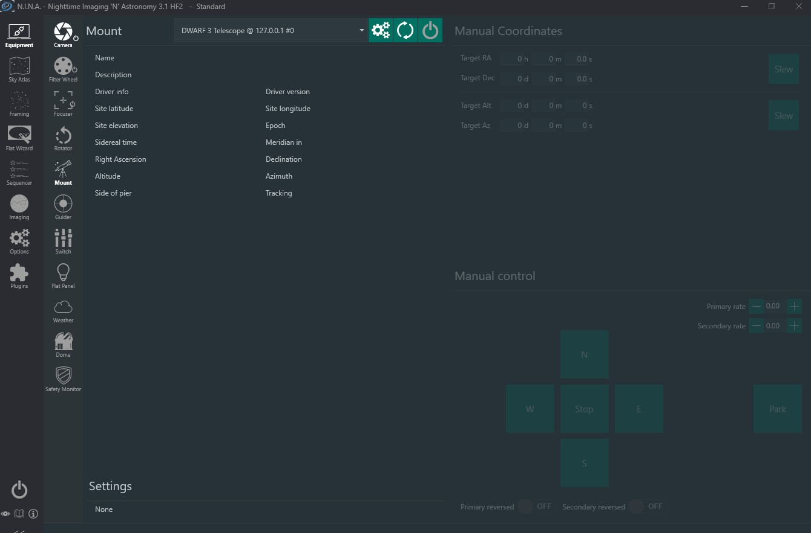

# DWARF Alpaca GUI Setup Guide

This guide walks you through installing the precompiled **DwarfAlpacaGUI.exe**, configuring the DWARF 3 Alpaca server, and connecting popular clients such as NINA. Follow the steps in order; screenshots are provided for each major milestone.

---

## 1. Prepare the Files

1. Download the release archive that contains `DwarfAlpacaGUI.exe`.
2. Extract the archive to a writable directory (for example, `C:\DWARFAlpaca`).
3. Ensure the following folders are present after extraction:
   - `DwarfAlpacaGUI.exe` (the compiled GUI)

> **Note**: If you are upgrading from an older build, keep your existing `var/` directory so stored credentials and logs remain available.

---

## 2. Launch the Control Center

1. Double-click `DwarfAlpacaGUI.exe`. Windows SmartScreen may prompt you on first launch—choose **More info → Run anyway** if needed.
2. Allow the application through the Windows Defender firewall when prompted. The server exposes HTTP (default `11111`) and UDP discovery ports.
3. The Control Center opens on the **Server** tab (Screenshot 1). This is where you start or stop the Alpaca service.

### 2.1 Server Tab

- **Start server** button: Performs an optional preflight, acquires the DWARF master lock, and launches the Alpaca HTTP/UDP services.
- **Stop server** button: Gracefully tears down all device connections and shuts down the services.
- **Status panel**: Displays current state plus progress messages (preflight, master lock acquisition, etc.).

---

## 3. Provisioning the DWARF

The **Provisioning** tab lets you scan for DWARF units over BLE, push Wi-Fi credentials, and fetch available Wi-Fi networks.

Steps:

1. **Discover devices** – Press *Discover devices* to list nearby DWARF units. Select one to pre-fill the BLE MAC address.
2. **Fetch Wi-Fi list** – Press *Fetch Wi-Fi list* to retrieve SSIDs broadcast near the DWARF.
3. **Provision Wi-Fi** – Enter SSID, Wi-Fi password, optional BLE password (defaults to `DWARF_12345678`), and BLE MAC. Click *Provision Wi-Fi* to push credentials.
4. Monitor status messages at the bottom of the tab; provisioning updates and errors appear here.

Provisioning results are saved in `var/connectivity.json`, so subsequent runs can skip this step.

---

## 4. Adjust Server Overrides

Use the **Settings** tab to override key runtime options before starting the server.

| Field | Description |
| --- | --- |
| **HTTP host / port** | Network interface and port that the Alpaca HTTP server will bind to. Default: `0.0.0.0:11111`. |
| **DWARF IP** | The telescope’s reachable IP (STA or AP mode). Defaults to `192.168.88.1` until provisioning detects the STA address. |
| **WS client ID** | Identifier required to obtain the master lock. Choose the bundle that matches your DWARF model (DWARF 3 or DWARF 2) or enter a custom GUID. |
| **Force simulation mode** | Runs the entire stack without touching hardware—great for testing client connections. |
| **Skip connectivity preflight** | Bypass the master-lock and WS connectivity check on start (not recommended for hardware sessions). |
| **Preflight timeout / interval** | Tunables for the preflight retry loop (seconds). Increase the timeout if connecting over slow networks. |

All overrides apply when you press **Start server**. The defaults come from `src/dwarf_alpaca/config/settings.py` and may also be set via environment variables (`DWARF_ALPACA_*`) or YAML config files.

---

## 5. Start and Verify the Server

1. Confirm the DWARF is powered on and connected to your network (or enable **Force simulation mode**).
2. Click **Start server**. The status label will update (e.g., *“Running preflight checks”* → *“Awaiting Alpaca clients on http://HOST:PORT”*).
3. Open the **Logs** pane at the bottom for structured output; start/stop events and errors are mirrored here.
4. If you need to stop the stack, press **Stop server**. The log will show graceful shutdown details.

---

## 6. Configure NINA

NINA ships with Alpaca discovery enabled by default, so the DWARF endpoints usually appear automatically. If a device does not show up in any picker, press **Scan for devices** in the NINA dialog and then select the DWARF entry when it appears.

Screenshots 4–8 illustrate a full configuration sequence and the resulting star capture.

### 6.1 Add the Alpaca Camera (Screenshot 4)

1. Open **NINA → Options → Equipment → Camera**.
2. Click **Add** and choose **ASCOM Alpaca**. Confirm the **Host** matches the machine running DwarfAlpacaGUI and the **Port** matches the GUI’s HTTP port.
3. Use **Scan for devices** if needed; entries appear as `Dwarf 3 Camera @<ip> #0`. Pick the DWARF host you expect. The connected device should resemble Screenshot 4.

### 6.2 Add the Filter Wheel (Screenshot 5)

1. Navigate to **Options → Equipment → Filter Wheel** and add an **ASCOM Alpaca** entry.
2. Reuse the same host/port, click **Scan for devices** if the wheel is not listed, and pick the entry labelled `Dwarf 3 Filter Wheel @<ip> #0`.
3. Confirm the connection matches Screenshot 5.

### 6.3 Add the Focuser (Screenshot 6)

1. Go to **Options → Equipment → Focuser** and add an **ASCOM Alpaca** focuser.
2. After scanning when necessary, choose the listing `Dwarf 3 Focuser @<ip> #0` and save your equipment profile.
3. The status should mirror Screenshot 6.

### 6.4 Add the Mount (Screenshot 7)

1. Open **Options → Equipment → Telescope**.
2. Add an **ASCOM Alpaca** telescope, point it to the same host/port, and select the device reported as `Dwarf 3 Telescope @<ip> #0` (scan if it is not already visible).
3. The connected mount should look like Screenshot 7.

### 6.5 Capture Confirmation (Screenshot 8)

With all devices connected, return to NINA’s **Imaging** tab, start a short exposure, and verify stars appear as in Screenshot 8.

Save the equipment profile so future sessions reuse these connections automatically.

---

## 7. Configuration Reference

The compiled GUI reads the same `Settings` model as the CLI version. You can edit options in three ways:

1. **GUI Overrides** – Quick, per-session tweaks (Section 4).
2. **Environment variables** – Prefix with `DWARF_ALPACA_` (for example, `DWARF_ALPACA_HTTP_PORT=11800`).
3. **YAML profile** – Launch the GUI with `--config <file>` to preload custom settings.

Below is a condensed list of frequently-used settings:

| Setting | Default | Purpose |
| --- | --- | --- |
| `http_advertise_host` | Auto-detected | Override the host sent in Alpaca discovery replies. |
| `discovery_enabled` | `True` | Disable if another discovery responder is present on the network. |
| `ws_ping_interval_seconds` | `5.0` | Keepalive interval for DWARF websocket commands. |
| `temperature_refresh_interval_seconds` | `5.0` | How often the session requests updated temperature telemetry. |
| `go_live_before_exposure` | `True` | Automatically start RTSP preview before long exposures. |
| `allow_continue_without_darks` | `True` | Permit captures even when a dark library is missing. |
| `ftp_timeout_seconds` / `ftp_poll_interval_seconds` | `10` / `1` | Controls how long the session waits for image files.

For the complete schema, see [`src/dwarf_alpaca/config/settings.py`](src/dwarf_alpaca/config/settings.py).

---

## 8. Tips & Troubleshooting

- **Firewall rules**: Ensure both TCP (`HTTP port`) and UDP (`discovery_port`) are allowed inbound on the host machine.
- **Master lock failures**: If the GUI logs *“lock denied”*, double-check the WS client ID and confirm no other control app is connected to the DWARF.
- **Provisioning retries**: Increase the preflight timeout if the DWARF is slow to join your Wi-Fi network.
- **Simulation mode**: Great for validating NINA equipment profiles when the telescope is offline.
- **Logs**: Check `var/logs/dwarf-alpaca-start.log` for historical startup sessions.

---

## 9. Summary Checklist

1. Extract the release and keep `DwarfAlpacaGUI.exe`, `images/`, and `var/` together.
2. Launch the GUI, adjust overrides on the **Settings** tab, and start the server.
3. Provision the DWARF via BLE if it hasn’t been onboarded yet.
4. Configure NINA’s Alpaca devices using the same host/port presented by the GUI.
5. Connect and verify telescope, camera, focuser, and filter wheel control.

You are ready to control the DWARF 3 via Alpaca clients. Keep this guide handy for future deployments or when onboarding new machines.
